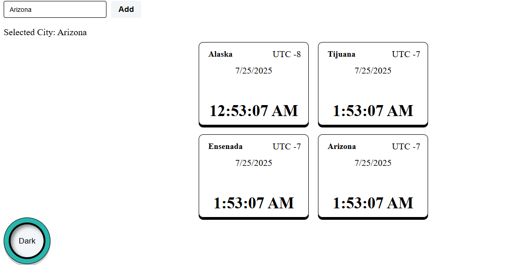

# Global clock
This app shows cards and information about time and date according to a selected cities and zone time.

Description: By default you will see 4 cities from Mexico. But you can add other cities by selecting them on the drop down menu on the left side.
You can also change the theme from white to black and from black to white.

Technologies: HTML, CSS and React + Vite.

